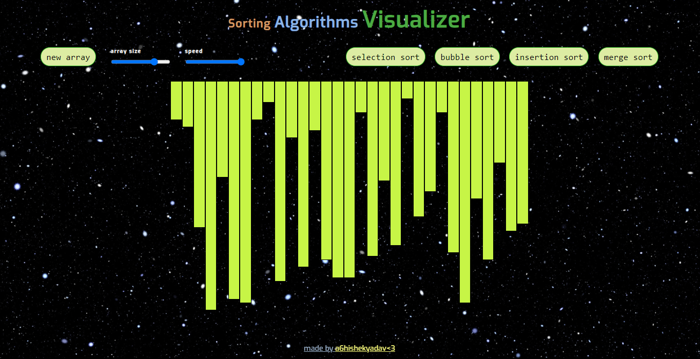

# Sorting Algorithm Visualizer

This project is a web-based application that visualizes various sorting algorithms to demonstrate how they work and how they differ in terms of efficiency and performance.

## Features

- Visualization of popular sorting algorithms:
  - Bubble Sort
  - Selection Sort
  - Insertion Sort
  - Merge Sort

- Adjustable array size and sorting speed for better visualization.

## Technologies Used

- HTML, CSS, JavaScript for the frontend

## Setup

1. Clone the repository to your local machine.

```bash
git clone https://github.com/yourusername/sorting-algorithm-visualizer.git
cd sorting-algorithm-visualizer
```

2. Locate and open the 'index.html' file in a web browser to run the application.

## Preview


<3


